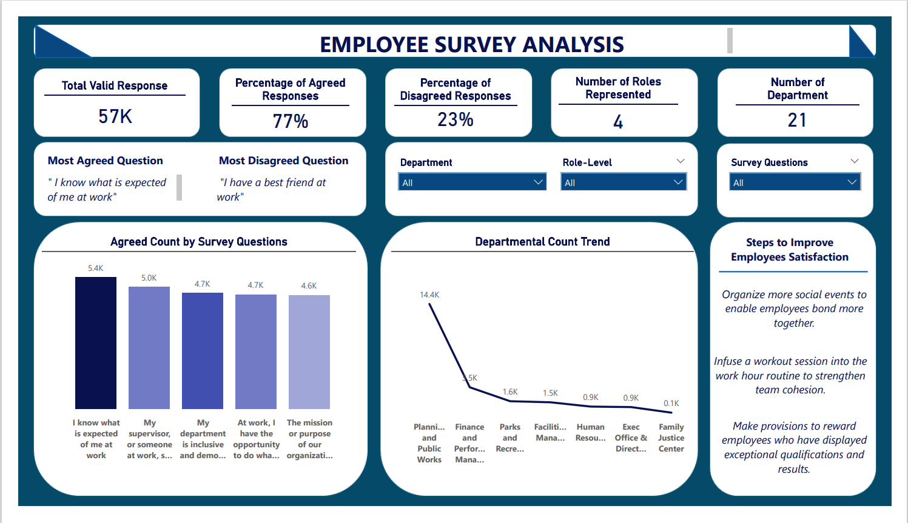
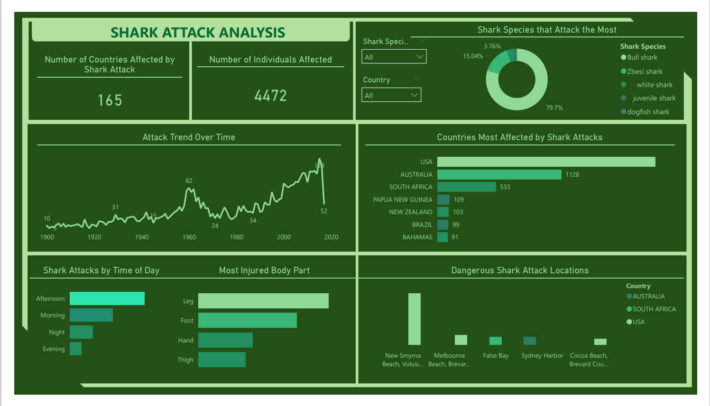
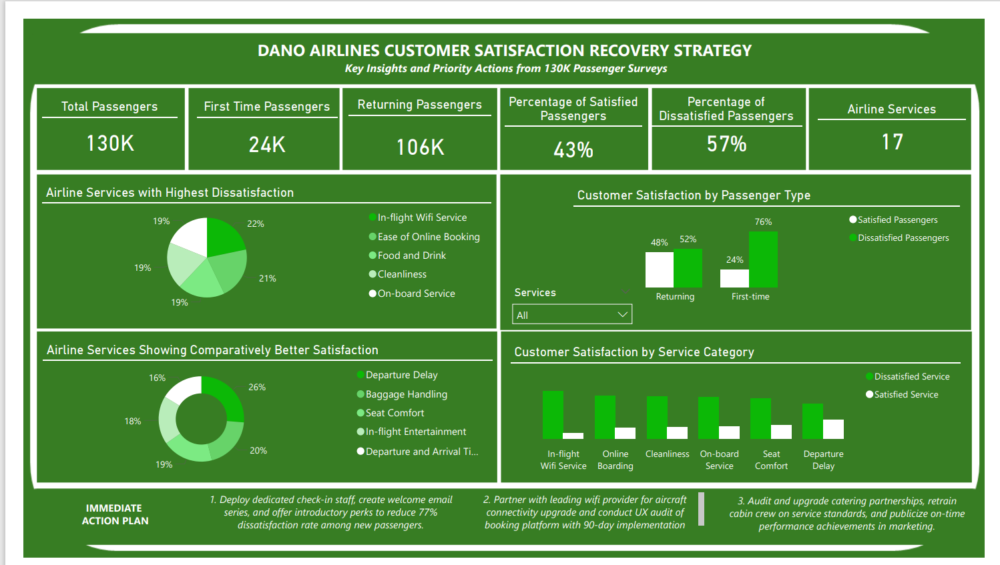

# Capstone Projects

## Overview
This repository contains my **capstone projects** completed during my Data Analytics training. These projects demonstrate my ability to **clean, transform, model, and analyze real-world datasets** using **Excel, SQL, Power BI, Power Query, and DAX**, and to **visualize data through interactive dashboards**. They showcase how I generate **actionable insights** to support **data-driven decision-making** across diverse business scenarios.

---

## Projects Included

### 1. Employee Survey Responses Analysis

**Dataset:** 14,725 employee survey responses from Pierce County, WA, capturing opinions across departments and roles.  

**Objective:** Identify key drivers of employee satisfaction, patterns across departments, and recommend improvements.  

**Skills Applied:** Data cleaning, Excel analysis, Power BI dashboard creation, visualization, trend analysis.  

**Key Insights & Recommendations:**  
- Survey questions with high disagreement highlight dissatisfaction areas.  
- Satisfaction trends vary by department and role.  
- Recommended improving communication, engagement, and targeted departmental interventions.

**Files:** [View Dashboard PDF](employee%20data%20dashboard_Precious_John.pdf) | [Download Power BI File](employee%20data.pbix)

---

### 2. Shark Attacks Analysis

**Dataset:** Global shark attack records spanning 100 years, including victim demographics, locations, time, and shark species.  

**Objective:** Analyze historical shark attack patterns to identify trends, risk locations, and factors influencing attack occurrences.  

**Skills Applied:** Data cleaning, text transformation, Power Query, Excel, Power BI dashboards, time series and location analysis.  

**Key Insights & Recommendations:**  
- Shark attacks show fluctuating trends over time.  
- Most attacks occur in specific countries and locations.  
- Extremities (arms/legs) are the most commonly injured body parts.  
- Certain species and times of day are higher risk — insights can guide safety recommendations.

**Files:** [View Dashboard PDF](Shark%20Attack%20Analysis_Precious_John.pdf) | [Download Power BI File](Shark%20Attack.pbix)

---

### 3. Dano Airlines Passenger Satisfaction Analysis

**Dataset:** 120,000+ passenger survey responses from Dano Airlines, including demographics, flight details, travel type, and satisfaction ratings.  

**Objective:** Analyze declining customer satisfaction (<50%) and provide data-driven recommendations to improve passenger experience.  

**Skills Applied:** Excel, Power BI, data transformation, modeling, dashboard creation, satisfaction trend analysis.  

**Key Insights & Recommendations:**  
- Service factors significantly influence satisfaction.  
- Passenger satisfaction varies by segment and travel type.  
- Recommended prioritizing high-impact service areas and monitoring satisfaction through continuous feedback.

**Files:** [View Dashboard PDF](Dano%20Airline%20Dashboard_Precious_John.pdf) | [Download Power BI File](Dano%20Airline.pbix)

---

## Tools & Skills
- **Excel** – Data cleaning, analysis, and transformations  
- **Power BI** – Interactive dashboards, DAX calculations, reporting  
- **Power Query** – Data transformation and preparation  
- **DAX** – Measures and calculations  
- Data visualization, insight generation, and business recommendations  

---

## Files in This Repository
- Employee Survey Dashboard (.pbix & .pdf)  
- Shark Attacks Dashboard (.pbix & .pdf)  
- Dano Airlines Dashboard (.pbix & .pdf)  
- Dashboard screenshots (images folder)
- README.md  

---

## Dano Airlines Passenger Satisfaction Analysis Dashboard Presentation
[*Watch the presentation video*](https://www.loom.com/share/7acba16c122b4a3aa1073def1a20b853)
